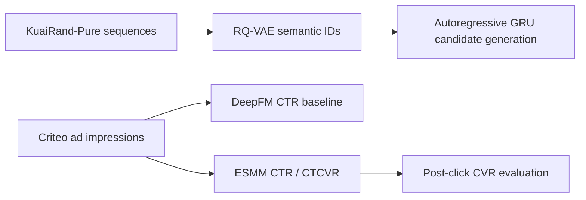

# Ads Recommendation Systems: Generative Retrieval and CTR/CVR Ranking

A reproducible, offline study of two recommendation components relevant to commerce advertising. The project intentionally separates its two data sources and does **not** claim an integrated end-to-end ads system.



## What was actually measured

The primary ranking experiment uses Criteo's Attribution Modeling for Bidding Dataset: a public, anonymized sample of 30 days of display-ad traffic with impression-level click and conversion labels. The source data card specifies `CC-BY-NC-SA-4.0`; the dataset is downloaded locally and is excluded from Git.

The fixed experiment reads the first 600,000 chronological rows, uses a 70/15/15 time split, a fixed seed of 7, and hashes only contemporaneous categorical fields (`uid`, `campaign`, nine contextual categories, and a time bucket). It evaluates all models on the held-out final time partition.

| Task | Model | ROC-AUC | PR-AUC | LogLoss |
| --- | --- | ---: | ---: | ---: |
| CTR | DeepFM | 0.5326 | 0.4091 | 2.7763 |
| CTR | ESMM | 0.5318 | 0.4032 | 2.8347 |
| Post-click CVR | DeepFM trained on clicks | 0.6967 | 0.2891 | 1.9369 |
| Post-click CVR | ESMM entire-space | 0.6887 | 0.2835 | 2.3889 |

In this configuration, DeepFM narrowly outperformed ESMM on CTR and post-click CVR. These outcomes are reported as measured, not selectively presented as improvements.

For retrieval, KuaiRand-Pure (CC BY-SA 4.0) provides timestamped user/video behavior and randomized exposure. It does not provide purchases or conversion labels. On an independent 120,000-row run, popularity achieved Recall@50 0.1322, item-ID GRU 0.1027, and the initial RQ-VAE semantic-ID GRU 0.0134. The semantic-ID implementation is a correctly logged research baseline, not a retrieval-quality claim.

## Reproduce

```bash
python3 -m venv .venv
.venv/bin/pip install -r requirements.txt

# Downloads source data; data are intentionally not committed.
.venv/bin/python scripts/download_criteo_attribution.py --output data/raw
PYTHONPATH=src .venv/bin/python scripts/run_criteo_ranking.py \
  --data data/raw/criteo_attribution_dataset.tsv.gz \
  --output experiments/criteo_attribution --rows 600000 --epochs 5 --seed 7

.venv/bin/python scripts/download_kuairand.py --output data/raw
PYTHONPATH=src .venv/bin/python scripts/run_experiment.py \
  --data data/raw --output experiments/kuairand_pure --max-rows 120000 --epochs 10 --seed 7

PYTHONPATH=src .venv/bin/pytest -q
```

## Modeling notes

`ESMM` models `P(click)` and `P(click AND conversion)`, then estimates post-click CVR as their ratio. In the Criteo experiment, CVR is evaluated only on clicked held-out impressions. The conversion label means a conversion observed in the 30 days following an impression; it can be attributed to another impression. It is therefore an offline prediction target, not causal incrementality.

The retrieval study trains an item-ID GRU, fits a two-stage residual-quantization VAE over its item vectors, assigns two-code semantic IDs, and trains a GRU that predicts the first code then the second code conditioned on the first. Candidate scores are evaluated against every known training item, without sampled-negative evaluation.

## Scope limits

- No source data, model checkpoints, or personal data are committed.
- There is no auction simulator, bid optimizer, online A/B test, or production deployment.
- The project does not claim that KuaiRand long-view is a purchase conversion.
- Data licenses, citations, and use constraints are recorded in [NOTICE.md](NOTICE.md).
