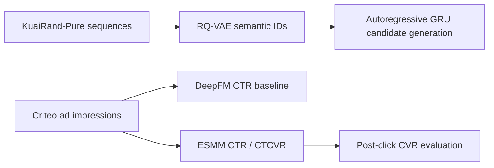

# Ads Recommendation Systems: Generative Retrieval and CTR/CVR Ranking

A reproducible, offline study of two recommendation components relevant to commerce advertising. The project intentionally separates its two data sources and does **not** claim an integrated end-to-end ads system.



## What was actually measured

The primary ranking experiment uses Criteo's Attribution Modeling for Bidding Dataset: a public, anonymized sample of 30 days of display-ad traffic with impression-level click and conversion labels. The source data card specifies `CC-BY-NC-SA-4.0`; the dataset is downloaded locally and is excluded from Git.

The fixed experiment reads the first 600,000 chronological rows (about 1.24 days of traffic), uses a 70/15/15 time split, and encodes only contemporaneous categorical fields (`uid`, `campaign`, and nine contextual categories). Vocabularies are fit on the training partition only; values seen fewer than two times in training, and every value first seen later, share an out-of-vocabulary index. Each model keeps the epoch with the lowest validation log loss, and all models are evaluated on the held-out final time partition. Results are the mean ± standard deviation over seeds 7, 8, and 9.

| Task | Model | ROC-AUC | PR-AUC | LogLoss | Calibration |
| --- | --- | ---: | ---: | ---: | ---: |
| CTR | DeepFM | 0.6717 ± 0.0013 | 0.5428 ± 0.0014 | 0.6128 ± 0.0013 | 0.94 ± 0.03 |
| CTR | ESMM | 0.6713 ± 0.0005 | 0.5439 ± 0.0019 | 0.6117 ± 0.0007 | 0.96 ± 0.01 |
| Post-click CVR | DeepFM trained on clicks | 0.8564 ± 0.0010 | 0.5924 ± 0.0032 | 0.2777 ± 0.0013 | 1.01 ± 0.07 |
| Post-click CVR | ESMM entire-space | 0.8474 ± 0.0004 | 0.5671 ± 0.0015 | 0.2852 ± 0.0002 | 0.97 ± 0.04 |
| CTCVR (all impressions) | DeepFM pCTR × clicked-only pCVR | 0.8395 ± 0.0007 | 0.3113 ± 0.0023 | 0.1537 ± 0.0003 | 0.95 ± 0.09 |
| CTCVR (all impressions) | ESMM | 0.8331 ± 0.0008 | 0.2959 ± 0.0013 | 0.1557 ± 0.0001 | 0.94 ± 0.03 |

Calibration is the mean prediction divided by the observed rate (1.0 is ideal). DeepFM and ESMM tie on CTR within seed noise. The clicked-only DeepFM leads ESMM on post-click CVR and on CTCVR by about ten times the across-seed standard deviation. These outcomes are reported as measured, not selectively presented as improvements.

An earlier version of this experiment reported CTR AUC 0.533 and post-click CVR AUC 0.697. Those numbers came from implementation defects, not from the data; [docs/EXPERIMENT_LOG.md](docs/EXPERIMENT_LOG.md) lists each defect with the evidence for it. Adding Criteo's `time_since_last_click` field (log2 buckets, verified to refer only to earlier clicks) left validation loss unchanged, so it is kept as an opt-in ablation (`--recency`) rather than in the main configuration.

For retrieval, KuaiRand-Pure (CC BY-SA 4.0) provides timestamped user/video behavior and randomized exposure. It does not provide purchases or conversion labels. On an independent 120,000-row run, popularity achieved Recall@50 0.1322, item-ID GRU 0.1027, and the initial RQ-VAE semantic-ID GRU 0.0134. The semantic-ID implementation is a correctly logged research baseline, not a retrieval-quality claim.

## Reproduce

```bash
python3 -m venv .venv
.venv/bin/pip install -r requirements.txt

# Downloads source data; data are intentionally not committed.
.venv/bin/python scripts/download_criteo_attribution.py --output data/raw
PYTHONPATH=src .venv/bin/python scripts/run_criteo_ranking.py \
  --data data/raw/criteo_attribution_dataset.tsv.gz \
  --output experiments/criteo_attribution --rows 600000 --max-epochs 10 --seeds 7 8 9
# Ablation with the time-since-last-click bucket:
PYTHONPATH=src .venv/bin/python scripts/run_criteo_ranking.py \
  --recency --output experiments/criteo_attribution_recency

.venv/bin/python scripts/download_kuairand.py --output data/raw
PYTHONPATH=src .venv/bin/python scripts/run_experiment.py \
  --data data/raw --output experiments/kuairand_pure --max-rows 120000 --epochs 10 --seed 7

PYTHONPATH=src .venv/bin/pytest -q
```

## Modeling notes

`ESMM` has a CTR tower and a CVR tower that read one shared set of field embeddings, and it is trained only on `P(click)` and `P(click AND conversion) = pCTR × pCVR`, both of which are labeled on every impression. Each tower uses the same DeepFM head as the baseline. In the Criteo experiment, CVR is evaluated only on clicked held-out impressions, because the conversion-after-click label exists only there; CTCVR is evaluated on all held-out impressions. The conversion label means a conversion observed in the 30 days following an impression; it can be attributed to another impression. It is therefore an offline prediction target, not causal incrementality.

The retrieval study trains an item-ID GRU, fits a two-stage residual-quantization VAE over its item vectors, assigns two-code semantic IDs, and trains a GRU that predicts the first code then the second code conditioned on the first. Candidate scores are evaluated against every known training item, without sampled-negative evaluation.

## Scope limits

- No source data, model checkpoints, or personal data are committed.
- There is no auction simulator, bid optimizer, online A/B test, or production deployment.
- The project does not claim that KuaiRand long-view is a purchase conversion.
- Data licenses, citations, and use constraints are recorded in [NOTICE.md](NOTICE.md).
