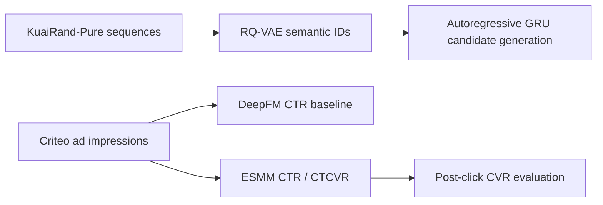

# Ads Recommendation Systems: Generative Retrieval and CTR/CVR Ranking

A reproducible, offline study of two recommendation components relevant to commerce advertising. The project intentionally separates its two data sources and does **not** claim an integrated end-to-end ads system.



## What was actually measured

The primary ranking experiment uses Criteo's Attribution Modeling for Bidding Dataset: a public, anonymized sample of 30 days of display-ad traffic with impression-level click and conversion labels. The source data card specifies `CC-BY-NC-SA-4.0`; the dataset is downloaded locally and is excluded from Git.

The fixed experiment reads the first 600,000 chronological rows (about 1.24 days of traffic), uses a 70/15/15 time split, and encodes only contemporaneous categorical fields (`uid`, `campaign`, and nine contextual categories). Vocabularies are fit on the training partition only; values seen fewer than two times in training, and every value first seen later, share an out-of-vocabulary index. Each model keeps the epoch with the lowest validation log loss, and all models are evaluated on the held-out final time partition. Results are the mean ± standard deviation over seeds 7, 8, and 9.

| Task | Model | ROC-AUC | PR-AUC | LogLoss | Calibration |
| --- | --- | ---: | ---: | ---: | ---: |
| CTR | Logistic regression | 0.6682 | 0.5408 | 0.6135 | 0.96 |
| CTR | DeepFM | 0.6717 ± 0.0013 | 0.5428 ± 0.0014 | 0.6128 ± 0.0013 | 0.94 ± 0.03 |
| CTR | ESMM | 0.6713 ± 0.0005 | 0.5439 ± 0.0019 | 0.6117 ± 0.0007 | 0.96 ± 0.01 |
| Post-click CVR | Logistic regression trained on clicks | 0.8485 | 0.5671 | 0.2844 | 0.99 |
| Post-click CVR | DeepFM trained on clicks | 0.8564 ± 0.0010 | 0.5924 ± 0.0032 | 0.2777 ± 0.0013 | 1.01 ± 0.07 |
| Post-click CVR | ESMM entire-space | 0.8474 ± 0.0004 | 0.5671 ± 0.0015 | 0.2852 ± 0.0002 | 0.97 ± 0.04 |
| CTCVR (all impressions) | Logistic regression pCTR × pCVR | 0.8337 | 0.2920 | 0.1557 | 0.95 |
| CTCVR (all impressions) | DeepFM pCTR × clicked-only pCVR | 0.8395 ± 0.0007 | 0.3113 ± 0.0023 | 0.1537 ± 0.0003 | 0.95 ± 0.09 |
| CTCVR (all impressions) | ESMM | 0.8331 ± 0.0008 | 0.2959 ± 0.0013 | 0.1557 ± 0.0001 | 0.94 ± 0.03 |

Calibration is the mean prediction divided by the observed rate (1.0 is ideal). Logistic regression uses the same one-hot fields, with its L2 strength chosen on validation log loss; it is deterministic, so it has no seed spread. For scale, a constant prediction at the training rate scores log loss 0.657 (CTR), 0.399 (post-click CVR), and 0.198 (CTCVR).

Both deep models lead logistic regression on CTR by about 0.003 AUC. On post-click CVR and CTCVR, DeepFM leads it by about 0.008 and 0.006, while ESMM trails it by about 0.001 and 0.0006. Most of the measurable signal is therefore available to a linear model on these eleven fields, and the deep models add little on 1.24 days of data. DeepFM and ESMM tie on CTR within seed noise, and the clicked-only DeepFM leads ESMM on post-click CVR and CTCVR by about ten times the across-seed standard deviation. These outcomes are reported as measured, not selectively presented as improvements.

An earlier version of this experiment reported CTR AUC 0.533 and post-click CVR AUC 0.697. Those numbers came from implementation defects, not from the data; [docs/EXPERIMENT_LOG.md](docs/EXPERIMENT_LOG.md) lists each defect with the evidence for it. Adding Criteo's `time_since_last_click` field (log2 buckets, verified to refer only to earlier clicks) left validation loss unchanged, so it is kept as an opt-in ablation (`--recency`) rather than in the main configuration.

For retrieval, KuaiRand-Pure (CC BY-SA 4.0) provides timestamped user/video behavior and randomized exposure. It does not provide purchases or conversion labels. The experiment keeps every standard-log interaction of the 2,488 users with an id below 2,500 (130,769 rows), splits them 70/15/15 by time, and predicts each click from the user's previous five clicks. Each model keeps the epoch with the lowest validation negative log-likelihood, and candidates are ranked against all 4,647 training items. Results are the mean ± standard deviation over seeds 7, 8, and 9 on 7,239 held-out clicks.

| Model | Recall@10 | Recall@50 | NDCG@50 | MRR |
| --- | ---: | ---: | ---: | ---: |
| Popularity | 0.0349 | 0.1199 | 0.0376 | 0.0210 |
| Item-ID GRU | 0.0355 ± 0.0010 | 0.1187 ± 0.0002 | 0.0367 ± 0.0003 | 0.0202 ± 0.0004 |
| RQ-VAE semantic-ID GRU | 0.0377 ± 0.0015 | 0.1247 ± 0.0019 | 0.0379 ± 0.0009 | 0.0204 ± 0.0008 |

The semantic-ID GRU leads popularity on Recall@10 (+0.0028) and Recall@50 (+0.0048), margins of about two and two and a half across-seed standard deviations, and is within one standard deviation of popularity on NDCG@50 and MRR. The item-ID GRU does not beat popularity. On this same sample, the previous pipeline reached Recall@50 0.0143 with the semantic-ID GRU and 0.0991 with the item-ID GRU; [docs/EXPERIMENT_LOG.md](docs/EXPERIMENT_LOG.md) lists the defects responsible and the validation-only comparison used to choose the semantic-ID design.

## Reproduce

```bash
python3 -m venv .venv
.venv/bin/pip install -r requirements.txt

# Downloads source data; data are intentionally not committed.
.venv/bin/python scripts/download_criteo_attribution.py --output data/raw
PYTHONPATH=src .venv/bin/python scripts/run_criteo_ranking.py \
  --data data/raw/criteo_attribution_dataset.tsv.gz \
  --output experiments/criteo_attribution --rows 600000 --max-epochs 10 --seeds 7 8 9
# Ablation with the time-since-last-click bucket:
PYTHONPATH=src .venv/bin/python scripts/run_criteo_ranking.py \
  --recency --output experiments/criteo_attribution_recency

.venv/bin/python scripts/download_kuairand.py --output data/raw
PYTHONPATH=src .venv/bin/python scripts/run_experiment.py \
  --data data/raw --output experiments/kuairand_pure --users 2500 --max-epochs 30 --seeds 7 8 9

PYTHONPATH=src .venv/bin/pytest -q
```

## Modeling notes

`ESMM` has a CTR tower and a CVR tower that read one shared set of field embeddings, and it is trained only on `P(click)` and `P(click AND conversion) = pCTR × pCVR`, both of which are labeled on every impression. Each tower uses the same DeepFM head as the baseline. In the Criteo experiment, CVR is evaluated only on clicked held-out impressions, because the conversion-after-click label exists only there; CTCVR is evaluated on all held-out impressions. The conversion label means a conversion observed in the 30 days following an impression; it can be attributed to another impression. It is therefore an offline prediction target, not causal incrementality.

The retrieval study builds item vectors from the positive pointwise mutual information between each training click and the five clicks before it, compressed with a truncated SVD. It standardizes them and fits a two-stage residual-quantization VAE (32 codes per stage, 2,000 full-batch steps). Items that share both codes receive a third token, numbered by descending training popularity, so every item has a unique semantic ID, as in TIGER. A GRU encodes the click history, and a GRU-cell decoder predicts the three tokens left to right, so each token's distribution depends jointly on the user and on the tokens before it. Because IDs are unique, the summed token log-likelihood equals log P(item | history); it is used for early stopping and to score every training item exhaustively, without sampled negatives or beam search.

## Scope limits

- No source data, model checkpoints, or personal data are committed.
- There is no auction simulator, bid optimizer, online A/B test, or production deployment.
- The project does not claim that KuaiRand long-view is a purchase conversion.
- Data licenses, citations, and use constraints are recorded in [NOTICE.md](NOTICE.md).
